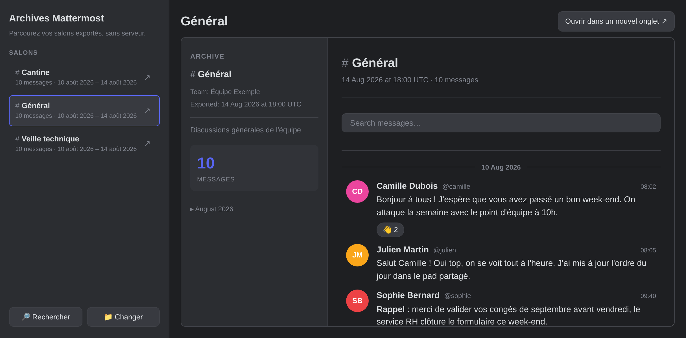

# mattermost-channel-export

Three scripts to select, export a Mattermost channel messages and images, and render it as an HTML archive.

There is also `sommaire.html`, a single page to browse several exported channels at once.



- [Project website](https://revolunet.github.io/mattermost-channel-export/): overview, `sommaire.html` and an example archive to download
- [`sommaire.html` demo over the example channels](https://revolunet.github.io/mattermost-channel-export/examples/)
- [standalone HTML export example](https://revolunet.github.io/mattermost-channel-export/examples/cantine/index.html)

Tested against Mattermost **10.12.4**.

---

## Scripts

| Script       | Input                 | Output                                          |
| ------------ | --------------------- | ------------------------------------------------ |
| `export.py`  | Mattermost REST API   | `<channel-slug>/<channel-slug>.json` + downloaded images |
| `export_channels_list.py` | Mattermost REST API | `channels.tsv` |
| `to_html.py` | `<channel-slug>/<channel-slug>.json` | `<channel-slug>/index.html` |

`export.py` writes each channel's JSON and its downloaded images into its own
`<channel-slug>/` directory, so `to_html.py`'s `index.html` can reference the
images as plain relative paths (see below). The archive is that whole
directory, not a single file.

---

## Setup

```bash
uv sync
cp .env.example .env
# Edit .env with your Mattermost URL and personal access token
```

---

## Export Channels List — `export_channels_list.py`

Export channels that the user is a member of to a TSV file with columns: `name | id | Open or Private | members count`

```bash
uv run --env-file .env export_channels_list.py [-o output.tsv]
```

---

## Export a channel's messages — `export.py`

Fetches the full history of a channel via the Mattermost API and writes a clean JSON file.

```bash
uv run --env-file .env export.py
```

### Environment variables

You can `cp .env.example .env` and edit the values there.
`.env` is gitignored.

| Variable        | Required | Description                                                                                              |
| --------------- | -------- | -------------------------------------------------------------------------------------------------------- |
| `MM_URL`        | Yes      | Base URL of your instance, e.g. `https://mattermost.example.com`                                         |
| `MM_TOKEN`      | Yes      | Personal access token (Account Settings → Security → Personal Access Tokens)                             |
| `MM_CHANNEL_ID` | Yes      | ID of the channel(s) to export. Comma-separated for multiple channels, e.g. `abc123,def456`              |
| `MM_OUTPUT_DIR` | No       | Directory where the output files are written (default: current directory)                                |
| `MM_COOKIE`     | No       | Cookie header to send with every request, needed when the instance sits behind an auth proxy (see below) |
| `MM_DOWNLOAD_IMAGES` | No  | Download shared images (`image/*` files) next to the JSON (default: `true`). Set to `false` to skip.     |


### Cookie-based authentication (`MM_COOKIE`)

If the Mattermost instance is behind `oauth2-proxy`, a personal access token alone may not be enough to get past the proxy. In that case, grab the `_oauth2_proxy` cookie value from your browser's dev tools (Application/Storage → Cookies) after logging in, and export it:

`MM_COOKIE` accepts a standard `key=value; key2=value2` cookie string, so you can pass additional cookies alongside `_oauth2_proxy` if needed.

### Usage

If you have setup channel ID(s) and output dir in your `.env` you can simply run

```bash
uv run --env-file .env export.py
```

### What it exports

- All messages, chronologically ordered, fully paginated
- Per-message: author (username, display name), timestamp, message text, edit status
- Reactions with emoji and list of users
- File attachments (name, MIME type, size). Images (PNG, JPEG, GIF, …) are also
  downloaded next to the JSON, and get a `local_path` pointing to the file.
  Other file types (PDF, docs, …) are listed but not downloaded.
- Link embeds (URL, OpenGraph title and description)
- Thread replies nested under their root post
- System messages and deleted posts are excluded

Re-running `export.py` is safe and cheap: images already present on disk
(same size as reported by the server) are not re-downloaded.

### Output format

Voir `examples/general/general.json` pour un exemple complet de sortie (canal, messages, réactions, fichiers, threads).

## Render a proper HTML page with a channel's history — `to_html.py`

Converts the JSON export into a static HTML page (no external dependencies, works offline). It has no network dependency of its own; when the JSON references downloaded images (`local_path`), it expects them next to the JSON, which is where `export.py` put them.

```bash
uv run --env-file .env to_html.py [input.json] [output.html]

# defaults:
uv run --env-file .env to_html.py
# reads channel_export.json → writes index.html next to it
```

### Features

- Dark theme (Discord-style), clean and readable
- Sidebar with channel info, message count, and month-by-month navigation
- Messages grouped by date with dividers
- User avatars with initials, color-coded by username
- Real Unicode emoji in reactions and message text (`:thumbsup:` → 👍)
- Markdown rendering: bold, italic, strikethrough, inline code, code blocks, blockquotes, headings, horizontal rules, **tables**
- Reactions shown as pills with user list on hover
- Images shown inline (click to open full size); other file attachments shown as pills with size
- Link embeds with title and description
- Thread replies collapsed by default, expandable inline
- Live search bar — filters messages and highlights matches in real-time
- Zebra-striped, horizontally-scrollable tables

---

## Browse multiple exported channels — `sommaire.html`

A single static, dependency-free page for browsing several exported channels at once, meant for non-technical users: no script to run, no server, any browser.

1. Unzip each exported channel into the same folder, and put `sommaire.html` next to them.
2. Double-click `sommaire.html`, click the button and pick that same folder.

```
my-archives/
├── sommaire.html
├── general/
│   ├── general.json
│   ├── index.html
│   └── e5f6a7b8_photo-equipe.svg
└── cantine/
    └── …
```

The page only reads the channels' JSON files, to list the channels and build a search index.
Each channel is then shown through a plain relative link to its `index.html`, which is why the page must sit in the picked folder.
Nothing is remembered between visits: the folder has to be picked again each time.

There is a search feature that accepts a Mattermost permalink (`https://…/pl/<id>`) or a raw message ID and opens the right channel at that message (`<channel>/index.html#msg-<id>`, which also works on its own).
Exports rendered before `to_html.py` handled that anchor work too: `sommaire.html` scrolls to the message, or to its thread's parent message, and says which one to look at (and which thread to expand).

Security-wise, everything runs from `file://`, where browsers isolate each file from the others: a channel page, or an image in it, can't reach the other files or this page.

### Demo

- **Project website**: https://revolunet.github.io/mattermost-channel-export/ — built from `site/index.html`, offers `sommaire.html` and `archives-exemple.zip` (`sommaire.html` + the example channels) for download.
- **Channels browser**: https://revolunet.github.io/mattermost-channel-export/examples/ — the example channels, listed from a `salons.js` generated at deploy time (used instead of the folder picker when present).
- **Individual example channel pages** (rendered by `to_html.py`, published as-is):
  - https://revolunet.github.io/mattermost-channel-export/examples/general/index.html
  - https://revolunet.github.io/mattermost-channel-export/examples/cantine/index.html
  - https://revolunet.github.io/mattermost-channel-export/examples/veille-tech/index.html
